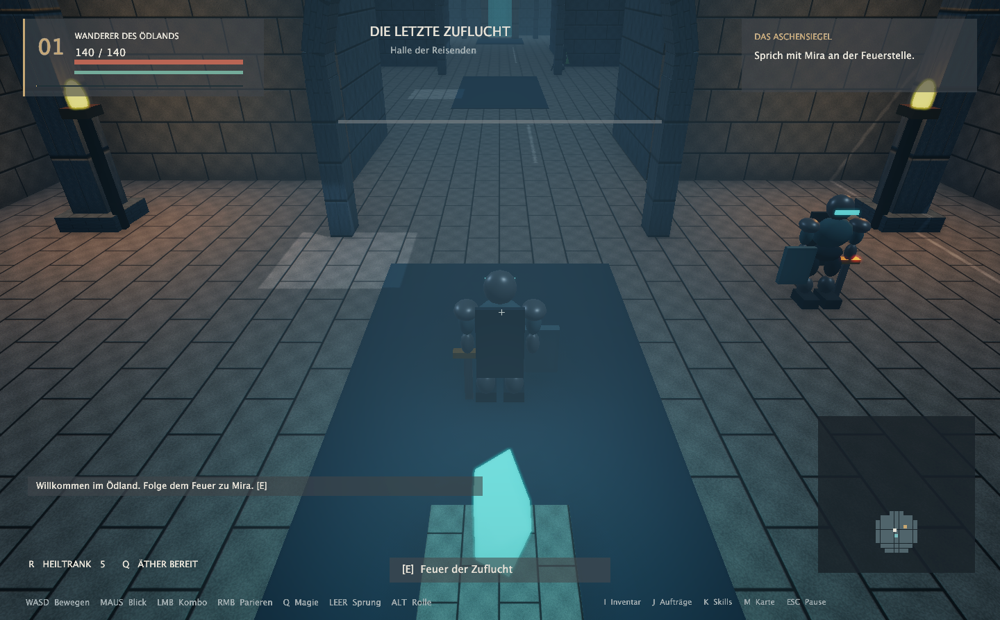

# Pentagon · Das Aschensiegel

Eine eigenständige, spielbare 3D-Neuauflage von **PentagonQuest** in Java/jMonkeyEngine. Das Ödland, der Ork-König und die ursprünglichen Gegner liefern den Ausgangspunkt; Architektur, Welt, Geschichte und Echtzeitsysteme sind neu.

Die Kampagne führt durch **fünf Gebiete mit 33 Räumen**, **zehn Aufträge**, **31 Gegner einschließlich eines Bosses mit drei Phasen**, vier ausbaubare Fähigkeiten und zwei mögliche Enden. Krypta und Kristallhöhlen lassen sich in beliebiger Reihenfolge erkunden. Die Entscheidung im Verlies verändert Ausrüstung und Bossstärke.

**Die ausgelieferte Grafik und Musik sind prozedurale bzw. synthetische Platzhalter.** Dies ist eine vollständige kleine spielbare Kampagne mit austauschbaren Assets, keine fertige AAA-Produktion. Hochwertige finale Charaktermodelle, Motion Capture, professionelles Sounddesign und umfassendes externes Balancing bleiben Produktionsarbeit.



## Starten

Voraussetzungen: **JDK 17 oder neuer**, **Maven 3.9+**, ein OpenGL-3.3-fähiger Grafiktreiber. Der erste Build benötigt Internetzugang für Maven Central. Die Startskripte unterstützen macOS, Linux und Windows; lokal geprüft wird die macOS-Fassung.

```bash
cd PentagonQuestRemastered
./build.sh verify
./run.sh
```

Unter Windows: `run.bat`. `./run.sh` baut die JAR automatisch, wenn sie noch nicht existiert; **nach Quellcodeänderungen erneut `./build.sh verify` ausführen**. Das eigenständige Paket liegt in `target/aschensiegel-1.0.0.jar` und enthält Engine, Assets und native Bibliotheken.

Unter macOS erzeugt `./tools/package-macos.sh` aus der aktuellen JAR zusätzlich **`target/native/Pentagon.app`** zum direkten Öffnen; das Bundle enthält eine eigene Java-Laufzeit.

```bash
./run.sh --fast          # weniger teure Grafik, im Spiel auch F3
./run.sh --no-audio      # für Systeme ohne Audioausgabe
./run.sh --smoke         # automatisierter nativer Integrationstest, etwa 90 Sekunden
```

Der Launcher setzt auf macOS `-XstartOnFirstThread`. AWT läuft für ImageIO im Headless-Modus, damit es nicht mit der Cocoa-Ereignisschleife konkurriert. Java 25 meldet einen Deprecation-Hinweis aus LWJGLs `Unsafe`-Nutzung; das Spiel benötigt keine Python-/Pygame-Laufzeit.

## Spielen

| Taste | Aktion |
|---|---|
| WASD / Maus | Bewegen / Third-Person-Kamera |
| Shift / Leertaste / Alt | Sprint / Sprung / Ausweichrolle |
| Linke Maustaste | Nahkampf; erneuter Klick während des Angriffs merkt den nächsten Komboschlag vor |
| Rechte Maustaste | Blocken; innerhalb von 230 ms vor dem Treffer parieren |
| Q / R | Äthergeschoss / Heiltrank |
| E | Dialog, Beute, Schrein, Rätsel, Bereichswechsel |
| I / J / K / M | Inventar / Aufträge / Fähigkeiten / Karte |
| Escape | Pause oder Ansicht schließen |
| Einstellungen | Über Hauptmenü oder Pause: Regler für Gesamt, Musik und Effekte |
| F5 / F9 | Speichern / letzten Spielstand laden |
| F3 / F10 / F12 | Grafikprofil / Ton umschalten / Screenshot |
| 1–3 | Antwort in einem Dialog auswählen |

Sprich zuerst mit **Mira rechts vom ersten Schrein**. Am Rastfeuer werden Leben und Ausdauer wiederhergestellt und kleine Heiltränke auf mindestens drei ergänzt. Speicherstände sind nur außerhalb des Kampfes, am Boden und ohne aktive Projektile möglich. **Speichere am ersten Schrein.** Nach dem Tod wird der letzte Speicherpunkt dieser Kampagne wiederhergestellt.

Die orange Markierung kündigt gegnerische Angriffe an. Orks schlagen langsam und hart; Wächter sind außerhalb ihrer Angriffe gepanzert; Aschenrufer halten Abstand. Gegen die große Aschenwelle des Königs helfen Springen, Distanz und Ausweichen.

## Spielstände und Dateien

* Normaler Spielstand: `~/.pentagon-aschensiegel/saves/campaign.json`.
* Einstellungen: `~/.pentagon-aschensiegel/saves/settings.json`. Eine beschädigte Datei fällt still auf die Standardwerte zurück und blockiert nie den Start.
* Automatische Sicherung des vorherigen gültigen Spielstands: `campaign.backup.json`.
* Smoke-Test: ausschließlich `target/smoke-saves/`, unabhängig vom normalen Spielstand.
* Screenshots: `~/.pentagon-aschensiegel/screenshots/`, im Smoke-Test `target/screenshots/`.
* Maven-Cache: `.cache/maven/`; `./build.sh clean` löscht keine normalen Spielstände.

Für einen abweichenden Speicherordner beim direkten Java-Start: `-Dpentagon.saveDir=/absoluter/pfad` **vor** `-jar` setzen; auf macOS zusätzlich `-XstartOnFirstThread`.

## Technik und Entwicklung

Java 17 als Bytecode-Ziel, jME **3.8.1-stable**, Minie **9.0.3** für natives Bullet, LWJGL3, Gson, JUnit 5. Abhängigkeiten sind fest versioniert. [jME-Maven-Dokumentation](https://wiki.jmonkeyengine.org/docs/3.8/getting-started/maven.html), [Minie-Integration](https://stephengold.github.io/Minie/minie/minie-library-tutorials/add.html).

* [Architektur und Erweiterung](docs/ARCHITECTURE.md)
* [Inhalt, Balancing und Lösungsweg](docs/GAME_DESIGN.md)
* [Blender-Import und Asset-Verträge](docs/ASSETS.md)
* [Prüfungen und bekannte Grenzen](docs/VERIFICATION.md)
* [Analyse des Originals](docs/ORIGINAL.md)
* [Briefing für fremde Sessions und Asset-Zulieferung](docs/COWORK-BRIEFING.md)

```bash
./build.sh verify                     # Tests + ausführbares Paket
./tools/format.sh                     # fest versionierter Java-Formatter
java tools/AssetBaker.java            # eigene Texturen, Fontatlanten und WAVs neu erzeugen
python3 tools/make_reference_model.py # glTF-Referenzmodell neu erzeugen
```

`pentagonQuest.py` bleibt unverändert als inhaltliche Referenz erhalten.
