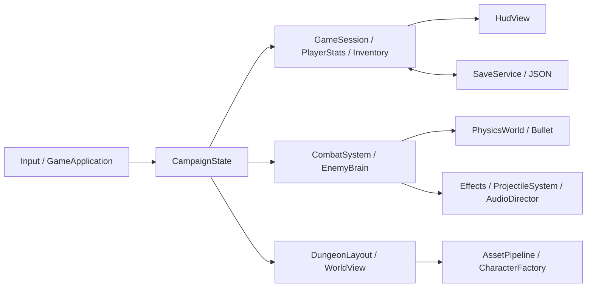

# Architektur

Die Anwendung trennt Zustandsmodell, Simulation und Darstellung nach dem MVC-Prinzip. Es gibt keine Abhängigkeit auf Pygame und keinen globalen Szenengraphen in den persistenten Daten. Ein vollständiges ECS wäre für diese Größe unnötig; die Systeme und stabilen IDs erlauben spätere Zerlegung.

| Package | Verantwortung |
|---|---|
| `core` | Bootstrap, Bildschirmzustände, Kampagnenkoordination, expliziter Smoke-Test |
| `entities` | Reine Charakterwerte sowie Laufzeit-Controller und Gegnerinstanzen |
| `world` | Deterministische Raumgraphen, Navigation, Geometrie und Atmosphärenfilter |
| `combat` | Angriffstaktung, räumliche Trefferprüfungen, Abwehr, Projektile und Effektpool |
| `ai` | Gegnerparameter und explizite Zustandsmaschine |
| `inventory` | Katalog, Stapel, Ausrüstung; Schlüsselitems belegen keine normalen Plätze |
| `quest` | Datengetriebene Ziele, Freischaltungen, einmalige Belohnungen |
| `save` | Validierung, atomarer Austausch, Backup-Recovery, Audioeinstellungen |
| `assets` | Import, PBR-Materialcache, Skelett-/Socket-Verträge, LOD, IBL |
| `physics` | Native Physik und Lebenszyklus statischer Kollisionskörper |
| `audio` | Musik-Crossfade, Ambient-Layer und begrenzte Effektstimmen |
| `ui` | Retained HUD und Menüseiten auf skalierbarer 1440×900-Zeichenfläche |

## Lebenszyklus

`Main` lädt die native Bullet-Bibliothek, bevor `BulletAppState` seine erste native Konfiguration erzeugt. `CampaignState` besitzt die aktuelle Welt, den Spieler und Gegner. Bei Bereichswechseln werden alte Bodies, Projektile und Szenenknoten entfernt. Kampagnen-IDs, besiegte Gegner, verbliebene Gegner-Lebenspunkte und Positionen bleiben im Modell erhalten.

Die fünf Dungeonabschnitte werden einzeln geladen. Jeder hat mehrere physisch verbundene Räume; Übergänge zwischen Abschnitten erfolgen bewusst über interaktive Tore. Es handelt sich nicht um eine nahtlos gestreamte Open World.

Bildschirmzustände: Hauptmenü, Spiel, Pause, Inventar, Journal, Fähigkeiten, Karte, Einstellungen, Dialog, Game Over, Epilog und Übergang. Die Einstellungsseite merkt sich, ob sie aus dem Hauptmenü oder aus der Pause geöffnet wurde, und kehrt dorthin zurück. Sie ist außerdem der einzige Overlay-Zustand, der die Musik nicht absenkt, damit die Regler die tatsächliche Lautstärke zeigen. Overlays halten Bullet, KI und Charakteranimationen an. Eingaben werden beim Wechsel zurückgesetzt, damit keine Bewegung hängen bleibt.

## Physik und Kampf

* Ein Meter entspricht einer Welteinheit, +Y ist oben, Figuren schauen nach +Z.
* BetterCharacterControl bewegt den Spieler und alle Gegner mit nativen Bullet-Kapseln. Die Simulation nutzt 120-Hz-Schritte mit bis zu acht Substeps.
* Fußboden und zusammengefasste Wandsegmente bilden statische Bullet-Boxen; Säulen und Bogenstützen haben eigene Collider.
* Die Kamera begrenzt ihre gewünschte Position mit fünf Strahlen, einschließlich Offsets für die Near Plane. Nach innen wird sofort korrigiert, nach außen geglättet.
* Nahkampf verwendet Reichweite, Höhenprüfung, Angriffssektor und Sichtprüfung. Treffer sind an aktive Zeitfenster gekoppelt; eine große Framezeit darf das Fenster nicht überspringen.
* Magie nutzt gepoolte native dynamische Kugelkörper mit CCD. Zusätzliche Segmenttests gegen Welt und Trefferkapseln verhindern übersprungene Treffer.
* Parieren kostet Ausdauer und unterbricht den Gegner. Blocken von hinten und gegen die große Bosswelle ist wirkungslos. Ausweichrollen besitzen ein begrenztes Unverwundbarkeitsfenster.

## KI und Navigation

`PATROL → ALERT → CHASE → ATTACK → RECOVER`, zusätzlich `FLEE`, `STUNNED`, `DEAD`. Wahrnehmung prüft Distanz und Sicht. Bei blockierter Direktverbindung wird ein BFS-Pfad auf dem Raumraster in begrenzter Frequenz berechnet. Das ist eine Raster-Navigation, kein Recast-Navmesh. Dynamische Gegner trennen sich durch Bullet; eine fortgeschrittene Crowd-Simulation ist nicht vorhanden.

## Speichern

Eine JSON-Datei mit `version=1` enthält Region, Spielerposition, Ausrüstung, Werte, Skills, Gold, Schlüssel, Entscheidungen, Gegnerstatus, Truhen, Questrewards, entdeckte Karte, Checkpoint und Spielzeit. Gson serialisiert ausschließlich Datenklassen, keine Engine-Objekte. Die Validierung verwirft unbekannte Versionen, ungültige Werte und übergroße Dateien.

Audioeinstellungen liegen bewusst außerhalb des Spielstands in `settings.json`: Sie überleben eine neue Kampagne, und ein beschädigter Spielstand kann sie nicht mitreißen. Anders als beim Spielstand ist Scheitern hier immer still — `load()` liefert die Standardwerte, `save()` schluckt Schreibfehler, weil eine Einstellungsdatei niemals eine laufende Partie unterbrechen darf.

Ein temporäres Dokument wird im selben Ordner geschrieben und möglichst atomar ersetzt. Vorher wird ein vorhandener gültiger Spielstand gesichert. Eine beschädigte Hauptdatei überschreibt kein intaktes Backup. Beim Laden wird ein Backup-Fallback sichtbar gemeldet. Eine neue Kampagne besitzt einen eigenen In-Memory-Checkpoint und kann nach dem Tod nicht versehentlich in einen früheren Spielstand springen.

## Performance

Statische Tile-Geometrie wird in räumlichen Chunks nach Material gebatcht; jME verwendet Frustum Culling. Felsen wechseln mit Hysterese zwischen zwei Mesh-Auflösungen. Fernere KI pausiert ihre Bewegung. Projektile (32), Trefferpartikel (120) und Soundeffekte (4 Stimmen pro Effekt) haben feste Pools. Materialien und Engine-Assets werden gecacht. Normalbetrieb lädt keine Assets beim einzelnen Treffer.

Der Grafikschalter entfernt SSAO, Bloom und Schatten für schwächere Hardware; lesbarer Nebel, Materialien und das Gameplay bleiben erhalten. Für finale hochauflösende Assets sind weitere GPU-/CPU-Profile und zusätzliche Charakter-LOD-Stufen nötig.
